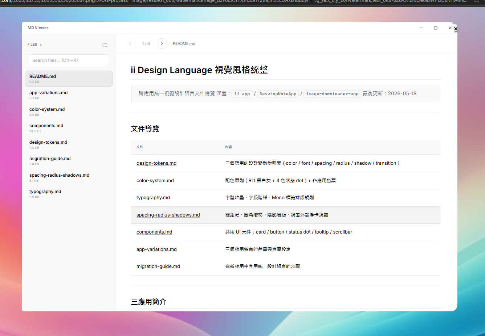
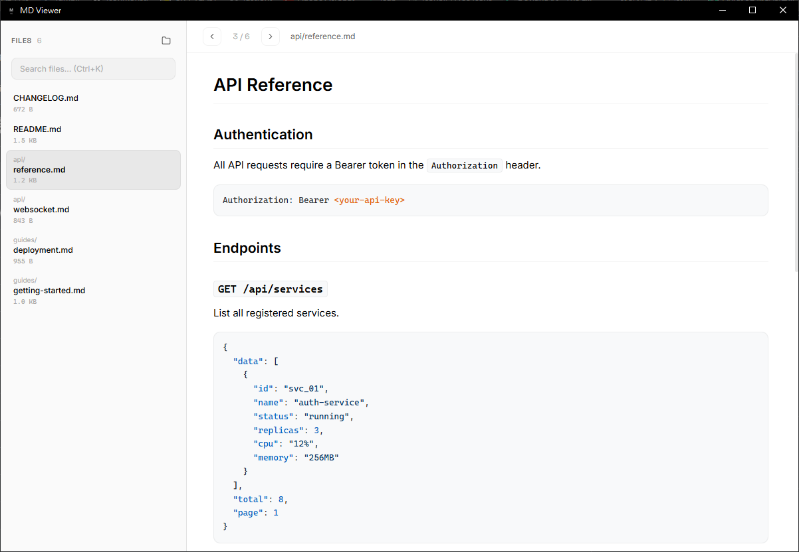

# MD Viewer

Lightweight desktop Markdown file browser built with **Tauri v2 + Vue 3 + TypeScript**.

Open a folder, browse all `.md` files in a sidebar, and read beautifully rendered Markdown with syntax-highlighted code blocks and inline images — no Electron, no bloat.

## Download

Grab a pre-built copy from the [latest release](https://github.com/ltangyu/md-viewer/releases/latest):

| Asset | Size | Description |
|-------|-----:|-------------|
| **`MD-Viewer-v0.1.0-portable-x64.zip`** | ~2.8 MB | **綠色免安裝版** — unzip and double-click `MD-Viewer.exe`, no installer needed |
| `MD Viewer_0.1.0_x64-setup.exe` | ~2.1 MB | NSIS installer — registers the `.md` file association |
| `MD Viewer_0.1.0_x64_en-US.msi` | ~3.1 MB | MSI installer — for managed deployment |

Requires Windows 10 (build 1803+) or Windows 11, 64-bit. Microsoft Edge WebView2 Runtime is required (pre-installed on Windows 10/11 since 2020).





---

## Features

- **Folder scanning** — recursively discovers all `.md` files via Rust `walkdir`
- **Markdown rendering** — powered by `marked` v15 with GitHub-Flavored Markdown
- **Syntax highlighting** — `highlight.js` for fenced code blocks
- **Local image support** — Rust reads images from disk and converts to base64 data URLs, so relative image paths just work
- **Single instance** — only one window at a time; opening a second file focuses the existing window and navigates to the new file
- **File association** — double-click any `.md` file in Explorer to open it directly (Windows `.md` / `.markdown` / `.mdx`)
- **Keyboard shortcuts** — `Alt+Up/Down` navigate files, `Ctrl+K` or `/` focus search, `Escape` clears
- **Search** — filter files by path with instant results
- **Remember last folder** — reopens your most recent directory on launch
- **Handles large files** — 200 MB truncation guard prevents freezing

## Tech Stack

| Layer | Technology |
|-------|-----------|
| Frontend | Vue 3 Composition API, TypeScript strict |
| Backend | Rust (Tauri v2) |
| Markdown | marked v15 + highlight.js v11 |
| Plugins | `tauri-plugin-dialog`, `tauri-plugin-single-instance` |
| Bundler | Vite 6 |
| Installer | NSIS with custom hooks |

## Project Structure

```
md-viewer/
├── src/                          # Vue frontend
│   ├── App.vue                   # Root: landing vs browser view
│   ├── main.ts                   # Vue app entry
│   ├── types/index.ts            # MdFileEntry type definitions
│   ├── composables/
│   │   ├── useFileSystem.ts      # Tauri command wrappers
│   │   └── useMarkdown.ts        # marked + highlight.js config
│   ├── components/
│   │   ├── LandingPage.vue       # Startup screen + folder picker
│   │   ├── FileBrowser.vue       # Main layout + keyboard shortcuts
│   │   ├── Sidebar.vue           # File list + search input
│   │   └── ContentView.vue       # Markdown renderer + image processing
│   └── styles/tokens.css         # Design tokens (CSS custom properties)
├── src-tauri/                    # Rust backend
│   ├── src/lib.rs                # 4 Tauri commands + single-instance setup
│   ├── src/main.rs               # Entry point
│   ├── tauri.conf.json           # App config + file associations
│   ├── capabilities/default.json # Security permissions
│   ├── nsis/hooks.nsi            # Windows installer registry hooks
│   └── icons/                    # App icons (all platforms)
├── index.html
├── package.json
├── tsconfig.json
└── vite.config.ts
```

## Tauri Commands (Rust)

| Command | Description |
|---------|-------------|
| `scan_md_files(dir)` | Recursively scan directory, return sorted `Vec<MdFileEntry>` |
| `read_text_file(path)` | Read file as UTF-8 string (lossy fallback) |
| `read_image_base64(path)` | Convert image to `data:mime;base64,...` URL |
| `get_launch_file()` | Return CLI argument `.md` path (for file association) |

## Getting Started

### Prerequisites

- [Node.js](https://nodejs.org/) >= 18
- [Rust](https://rustup.rs/) >= 1.77
- [Tauri v2 prerequisites](https://v2.tauri.app/start/prerequisites/)

### Development

```bash
npm install
npm run tauri dev
```

### Build

```bash
npm run tauri build
```

The installer will be output to `src-tauri/target/release/bundle/`.

## Keyboard Shortcuts

| Shortcut | Action |
|----------|--------|
| `Alt + Up` | Previous file |
| `Alt + Down` | Next file |
| `Ctrl + K` or `/` | Focus search |
| `Escape` | Clear search |

## Windows File Association

The NSIS installer registers MD Viewer as a handler for `.md`, `.markdown`, and `.mdx` files via custom hooks (`src-tauri/nsis/hooks.nsi`). This works around [Tauri #9803](https://github.com/tauri-apps/tauri/issues/9803) by writing the required `Capabilities` and `RegisteredApplications` registry entries that Tauri's default installer omits.

After installation, you can set MD Viewer as the default `.md` handler through **Settings > Default Apps**.

## License

MIT

---

# MD Viewer（繁體中文）

輕量級桌面 Markdown 檔案瀏覽器，使用 **Tauri v2 + Vue 3 + TypeScript** 打造。

打開資料夾，在側邊欄瀏覽所有 `.md` 檔案，閱讀經過精美渲染的 Markdown 內容 — 包含語法高亮的程式碼區塊和內嵌圖片 — 不用 Electron，無多餘開銷。

## 下載

從 [最新發布](https://github.com/ltangyu/md-viewer/releases/latest) 取得預先打包的版本：

| 檔案 | 大小 | 說明 |
|------|-----:|------|
| **`MD-Viewer-v0.1.0-portable-x64.zip`** | 約 2.8 MB | **綠色免安裝版** — 解壓後雙擊 `MD-Viewer.exe` 即可使用，不需要安裝程式 |
| `MD Viewer_0.1.0_x64-setup.exe` | 約 2.1 MB | NSIS 安裝程式 — 會註冊 `.md` 檔案關聯 |
| `MD Viewer_0.1.0_x64_en-US.msi` | 約 3.1 MB | MSI 安裝程式 — 適用於企業統一部署 |

系統需求：Windows 10（1803 以上版本）或 Windows 11，64 位元。需要 Microsoft Edge WebView2 Runtime（Windows 10/11 從 2020 年起預載）。


---

## 功能特色

- **資料夾掃描** — 透過 Rust `walkdir` 遞迴搜尋所有 `.md` 檔案
- **Markdown 渲染** — 採用 `marked` v15，支援 GitHub 風格 Markdown（GFM）
- **語法高亮** — 使用 `highlight.js` 為程式碼區塊上色
- **本地圖片支援** — Rust 後端讀取圖片並轉換為 base64 data URL，相對路徑的圖片直接顯示
- **單一實例** — 同時只開一個視窗；開啟第二個檔案時自動聚焦現有視窗並導航至新檔案
- **檔案關聯** — 在檔案總管中雙擊任何 `.md` 檔案即可直接開啟（支援 `.md` / `.markdown` / `.mdx`）
- **鍵盤快捷鍵** — `Alt+上/下` 切換檔案、`Ctrl+K` 或 `/` 聚焦搜尋、`Escape` 清除搜尋
- **搜尋過濾** — 依路徑即時過濾檔案列表
- **記住上次資料夾** — 啟動時自動重新開啟最近使用的目錄
- **大檔案處理** — 超過 200 MB 的檔案自動截斷，防止凍結

## 技術架構

| 層級 | 技術 |
|------|------|
| 前端 | Vue 3 Composition API、TypeScript strict 模式 |
| 後端 | Rust（Tauri v2）|
| Markdown | marked v15 + highlight.js v11 |
| 外掛 | `tauri-plugin-dialog`、`tauri-plugin-single-instance` |
| 打包工具 | Vite 6 |
| 安裝程式 | NSIS + 自訂 hooks |

## 專案結構

```
md-viewer/
├── src/                          # Vue 前端
│   ├── App.vue                   # 根元件：啟動畫面 / 瀏覽模式切換
│   ├── main.ts                   # Vue 應用程式進入點
│   ├── types/index.ts            # MdFileEntry 型別定義
│   ├── composables/
│   │   ├── useFileSystem.ts      # Tauri 指令封裝
│   │   └── useMarkdown.ts        # marked + highlight.js 設定
│   ├── components/
│   │   ├── LandingPage.vue       # 啟動畫面 + 資料夾選擇
│   │   ├── FileBrowser.vue       # 主佈局 + 鍵盤快捷鍵
│   │   ├── Sidebar.vue           # 檔案列表 + 搜尋輸入
│   │   └── ContentView.vue       # Markdown 渲染 + 圖片處理
│   └── styles/tokens.css         # 設計 tokens（CSS 自訂屬性）
├── src-tauri/                    # Rust 後端
│   ├── src/lib.rs                # 4 個 Tauri 指令 + 單實例設定
│   ├── src/main.rs               # 程式進入點
│   ├── tauri.conf.json           # 應用程式設定 + 檔案關聯
│   ├── capabilities/default.json # 安全權限設定
│   ├── nsis/hooks.nsi            # Windows 安裝程式 registry hooks
│   └── icons/                    # 應用程式圖示（全平台）
├── index.html
├── package.json
├── tsconfig.json
└── vite.config.ts
```

## Tauri 指令（Rust）

| 指令 | 說明 |
|------|------|
| `scan_md_files(dir)` | 遞迴掃描目錄，回傳排序後的 `Vec<MdFileEntry>` |
| `read_text_file(path)` | 以 UTF-8 讀取檔案（支援非 UTF-8 的寬鬆轉換）|
| `read_image_base64(path)` | 將圖片轉換為 `data:mime;base64,...` URL |
| `get_launch_file()` | 回傳啟動時的 CLI 參數 `.md` 路徑（用於檔案關聯）|

## 開始使用

### 前置需求

- [Node.js](https://nodejs.org/) >= 18
- [Rust](https://rustup.rs/) >= 1.77
- [Tauri v2 系統需求](https://v2.tauri.app/start/prerequisites/)

### 開發模式

```bash
npm install
npm run tauri dev
```

### 打包建置

```bash
npm run tauri build
```

安裝程式將輸出至 `src-tauri/target/release/bundle/`。

## 鍵盤快捷鍵

| 快捷鍵 | 動作 |
|--------|------|
| `Alt + 上` | 上一個檔案 |
| `Alt + 下` | 下一個檔案 |
| `Ctrl + K` 或 `/` | 聚焦搜尋列 |
| `Escape` | 清除搜尋 |

## Windows 檔案關聯

NSIS 安裝程式透過自訂 hooks（`src-tauri/nsis/hooks.nsi`）將 MD Viewer 註冊為 `.md`、`.markdown` 和 `.mdx` 檔案的處理程式。這是為了解決 [Tauri #9803](https://github.com/tauri-apps/tauri/issues/9803) — Tauri 預設安裝程式遺漏了 `Capabilities` 和 `RegisteredApplications` 等必要的 registry 項目。

安裝後，可透過 **設定 > 預設應用程式** 將 MD Viewer 設為 `.md` 的預設開啟程式。

## 授權條款

MIT
